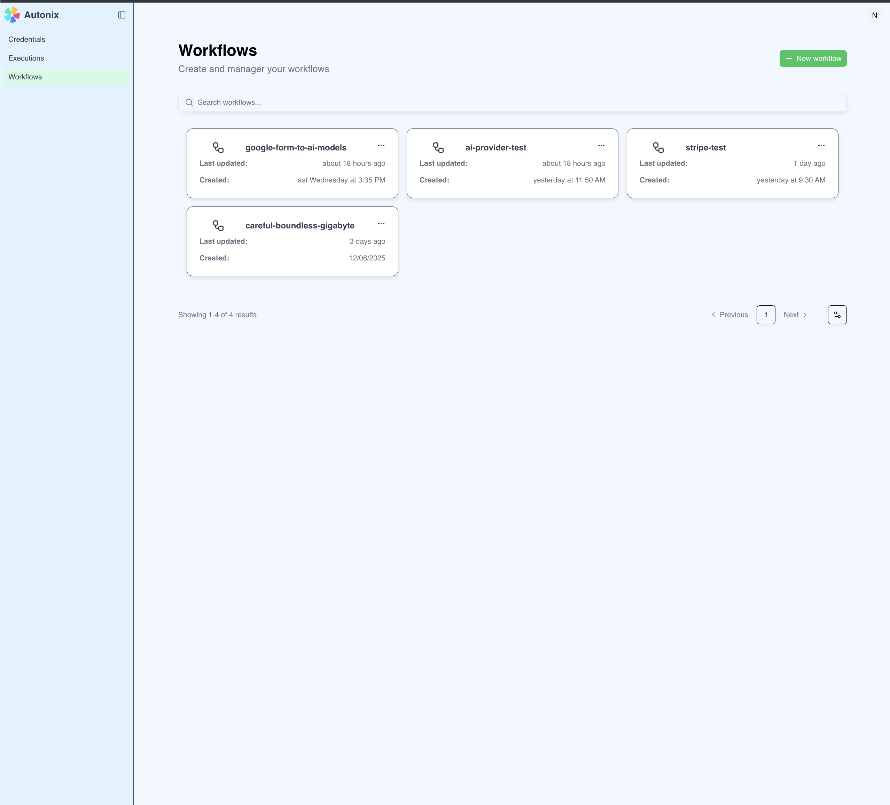
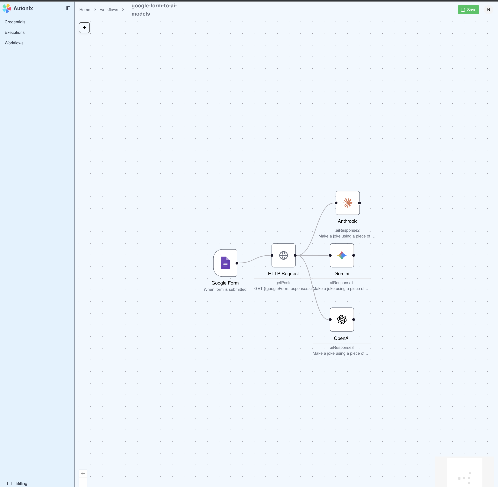
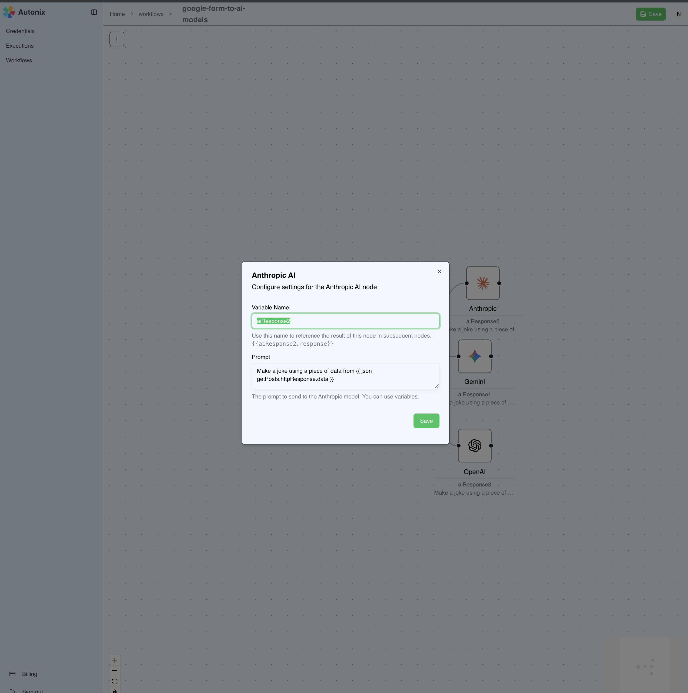

# Autonix

Autonix is a n8n and zapier like workflow automation platform.

# Features

Autonix currently supports building workflows using manual triggers, http request nodes, AI nodes(e.g. Google Gemini, Anthropic, and OpenAI) nodes, Stripe triggers, and a Google form trigger.

# Screenshots

## Workflows List View



## Workflow View



## Workflow Node Form View



# Dev

This project is being developed with node `v22.18.0`.

## Install dependencies

```
npm i
```

## Configure .env file

```
# Database (postgresql db instance)
DATABASE_URL=""

# Better Auth(better-auth.com)
BETTER_AUTH_SECRET=""
BETTER_AUTH_URL="http://localhost:3000"

# Polar Payments(polar.sh)
POLAR_ACCESS_TOKEN=""
POLAR_SUCCESS_URL="http://localhost:3000"
POLAR_SERVER="sandbox"

# Inngest
INGEST_RETRIES=0

# Next server config
NEXT_PUBLIC_APP_URL="http://localhost:3000"

# Ngrok (for local testing with webhooks)
NGROK_DOMAIN=""
```

## Run dev servers

```
npm run dev:all
```

# Architecture

## Asynchronous flow for Workflow Execution

When workflows are being evaluated, they are handled using Inngest(www.inngest.com). This allows longer
running computation steps to not block the UX. Inngest also has cool features that allow automatic retries,
and the ability to manual trigger workflow retries while developing.

## Polar for Payments and Subscriptions

Polar.sh is used for payments and subscriptions.

## Bring your own token

There is a settings menu that allows you to store an API token for the AI providers customers would like to
use in their workflows. This gives users full control over how much they use the platform since we are executing
actions on behalf of them with their credentials.

## Postgresql Relational Database

The data for this web application is being stored in Postgresql, and Prisma is being used to drive migrations
and schema creation. The whole application is working without any special extensions, but there is a table that
uses a `json` data type to store a users settings.
